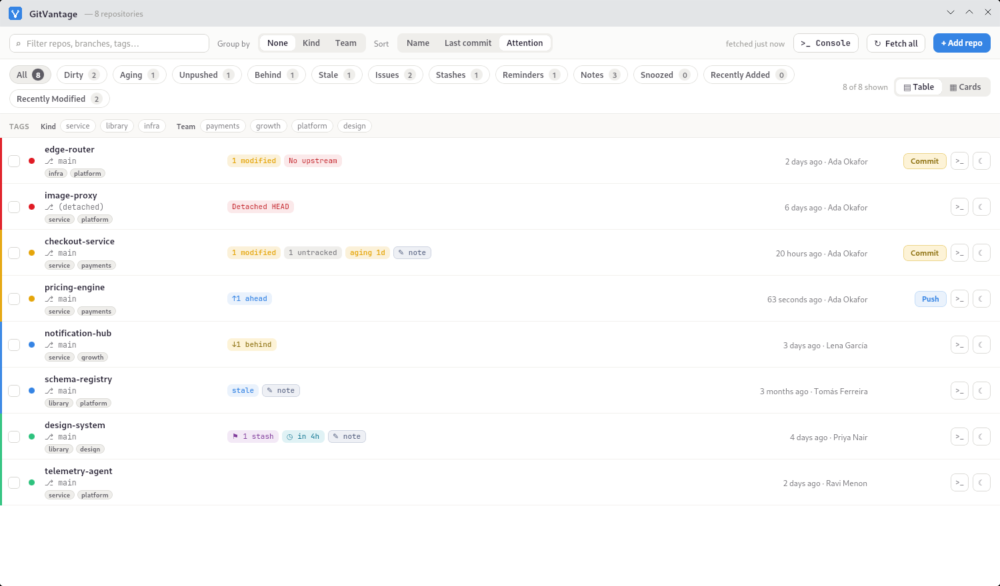
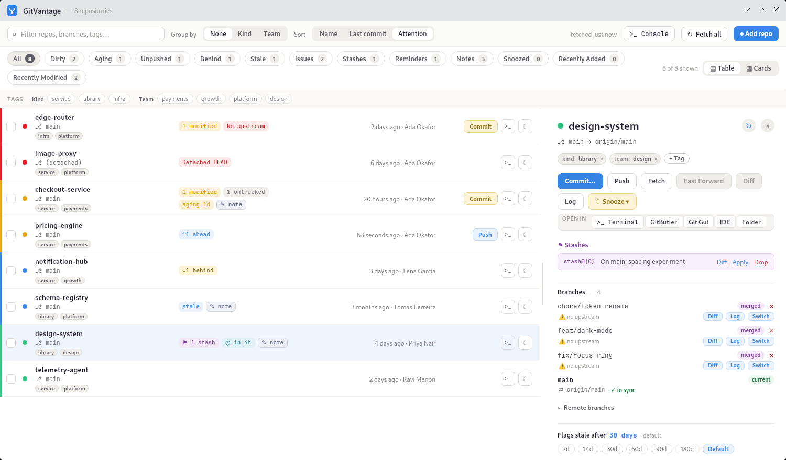
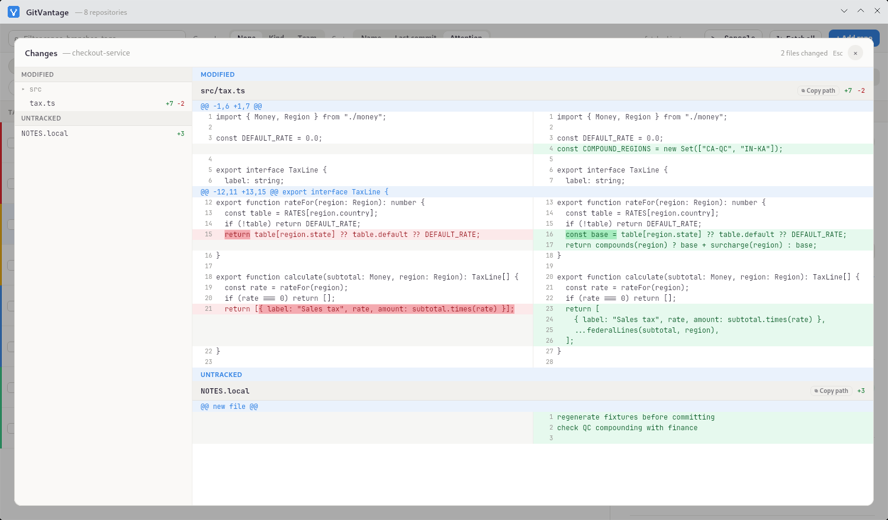
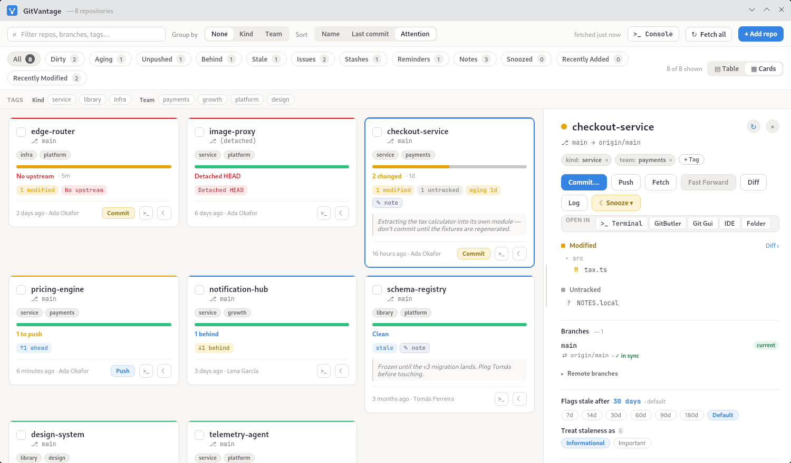

# GitVantage

A desktop dashboard that keeps every git repository you care about on one screen — so nothing you're working on quietly drifts out of sync, goes stale, or sits with uncommitted work you forgot about.

## The problem

Most developers no longer have *one* repo.
They have dozens, and keeping track of the state of all of them — what's dirty, what's unpushed, what's behind its remote, what's been sitting untouched — is a real, growing burden.

- **AI tooling lets us work on many things at once.**
  With coding agents you can now have work in flight across many repositories *simultaneously*.
  Branches, uncommitted changes, and pending pushes pile up faster than you can hold in your head.
- **Multi-repo microservice systems become hard to coordinate.**
  A single organization often spreads one product across many related-but-separate repositories (services, libraries, infra, submodules).
  Their states are coupled in your mind but scattered on disk.
- **Working across orgs and open source proliferate more repositories.**
  People contribute across multiple employers, clients, and open-source projects at once — each with its own repos, remotes, and rhythms.

GitVantage exists to make that whole surface visible and actionable at a glance.

## A look at it

Every tracked repo on one screen, sorted by how much it wants your attention — red is broken (detached HEAD, no upstream), yellow is work sitting on your machine (uncommitted or unpushed), blue is informational (behind the remote, or gone quiet), green is clean and in sync.



Select a repo and everything about it is one pane away — actions, stashes, branches with their tracking status, and how it decides this repo is stale.



Uncommitted work opens into a side-by-side diff with character-level highlighting, so you can see what you were in the middle of.



Prefer cards? The same information, laid out for scanning — with your working notes on the face of each one.



## What GitVantage does

GitVantage watches all your local repositories and gives you, in one place:

- **A live status dashboard** — every repo with its branch, ahead/behind, and an at-a-glance state (clean · dirty · unpushed · behind · stale · **aging** · problems · **open issues**).
  Table or card view.
- **Real-time updates** — a filesystem watcher re-scans a repo the moment its files change (even from the terminal or another tool), with a periodic background fetch and a manual refresh button for anything a watcher can't see (e.g. remote advances).
- **Powerful triage** — filter by status (dirty, aging, unpushed, stale, problems, open issues, awaiting you, stashes, worktrees, reminders, snoozed), group by tag namespace, sort by name / last commit / attention, and live-search across names, branches, and tags.
- **Namespaced tags + notes** — organize repos with `owner:me`, `lang:kotlin`, … (with inline autocomplete), and keep per-repo working notes.
  Bulk-tag, untag, and act on many repos at once.
- **A rich per-repo detail pane**:
  - Changed files (staged / modified / untracked) and a **GitHub-style side-by-side diff viewer** with character-level highlighting and a flattened file tree.
  - **Branches** with their tracking status vs upstream (ahead / behind / diverged / in sync) *and* vs mainline (merged / stale), one-click **switch**, **diff**, **copy the name**, and **delete** (mirrors `git branch -d/-D`).
  - **Remote branches** with last author, one-click checkout into a local tracking branch, and copy of the full ref.
  - **Stashes** — apply, drop, and diff.
  - **Submodules** — see the target repo, how far the pointer is **behind**, uncommitted changes inside, and fetch / update-the-pointer / diff-the-pending-move / add-as-a-tracked-repo / deinit — plus a link up to the parent superproject when it's also tracked.
  - **Worktrees** — every working tree sharing the repository, with the branch each holds, its last commit, and **uncommitted work sitting in another checkout** (invisible from this one), plus locked / stale-entry flags and a one-click `git worktree prune`. Linked worktrees say which checkout they came from, and any of them can be added as a tracked repo of its own.
- **Safe git actions** — commit, push, fetch, fast-forward, branch switch, stash ops; destructive ones are confirmed, and everything the app runs is recorded in a **git console** (with git's colors).
- **Reminders, snooze, and a notification outlook** — set reminders, snooze a repo's alerts for a while, and see a plain-language summary of exactly what will notify you and when (reminders, aging, stale, upstream advances), accounting for any active snooze.
  Desktop notifications fire for due reminders, for aging and stale threshold crossings, and — when you opt a repo in — when its upstream advances.
- **Aging detection** — flags repos whose uncommitted work has been sitting past a threshold, so long-forgotten changes surface instead of rotting.
- **Open issues and PRs** — **requires [GitHub CLI](https://cli.github.com)**: repos on GitHub (or GitHub Enterprise) get a per-repo count of what's open, and — the part that matters — which of them are **waiting on you**: your review is requested, you're assigned, the last comment @-mentions you, or someone replied on a thread you opened.
  Open issues are a blue heads-up by default (every healthy project has some) and turn yellow once one needs you; mark a repo's issues **Important** and both escalate a step, to yellow and red.
  Per-repo opt-out, and an "only mine" mode that ignores everything you aren't involved in.

  Install `gh` and run `gh auth login` to enable it. GitVantage reads issues *through* `gh`, so it never asks for, stores, or holds a token of your own — it reuses whatever that login already set up, including SSO and Enterprise hosts.
  Without `gh`, the rest of the dashboard is unaffected and the repo's detail pane says what's missing.
  Repos on other forges are simply left alone — see below.

## Git only — by design

GitVantage is a **git** tool, and will very likely stay that way.
Its whole vocabulary — upstreams, ahead/behind, stashes, submodule pointers, fast-forward, merged branches — is git-specific, and the UI leans into those concepts rather than abstracting them away.
Supporting other VCSs would mean a different, blander tool; GitVantage chooses to be great at git.

### Forge integration: GitHub for now

Everything above works on any git remote — issues and pull requests are the one exception, because they live in a forge rather than in git.
That integration is **GitHub-only so far** (github.com and GitHub Enterprise), and other forges aren't second-class so much as absent: on a GitLab, Azure DevOps, Gitea or remote-less repo the issues section simply doesn't appear.
That's deliberate. An empty "Issues & pull requests" heading would read as *"this repo has none"*, which is a different and wrong claim from *"GitVantage can't see them"*.

Enterprise hosts are recognised by asking `gh` which hosts it's logged into, rather than by guessing from the URL — a GitHub Enterprise install can live at any hostname, and `git.example.com` looks like nothing in particular.
The practical consequence: run `gh auth login --hostname your.github.host` and its repos light up; until then they're treated as an unsupported forge.

Other forges are a "not yet", not a "no" — unlike the VCS question above, nothing about the design rules them out.

## Installation

Grab the installer for your platform from the [latest release](https://github.com/rocketraman/gitvantage/releases/latest): `.deb` and `.rpm` (Linux), `.dmg` (macOS), `.msi` (Windows), each built for x86-64 and arm64.
The commands below assume version `1.0.0` and that you downloaded into the current directory — substitute the version and architecture of the asset you actually have.

Optionally, install the [GitHub CLI](https://cli.github.com) and run `gh auth login` to enable the issues and pull-request features.

### Linux

Debian / Ubuntu — use `apt` rather than `dpkg -i`, so dependencies are resolved:

```bash
sudo apt install ./gitvantage-1.0.0-linux-amd64.deb
```

Fedora / RHEL:

```bash
sudo dnf install ./gitvantage-1.0.0-linux-x86_64.rpm
```

### macOS

Open the `.dmg` and drag GitVantage into `/Applications` as usual, or from the command line — mount the disk image, copy the app across, and unmount:

```bash
hdiutil attach gitvantage-1.0.0-mac-arm64.dmg
sudo cp -R /Volumes/GitVantage\ 1.0.0-arm64/GitVantage.app /Applications/
# workaround https://github.com/rocketraman/gitvantage/issues/1
sudo xattr -dr com.apple.quarantine /Applications/GitVantage.app
sudo hdiutil umount /Volumes/GitVantage\ 1.0.0-arm64
```

The releases aren't signed or notarized yet, so either way Gatekeeper quarantines the installed bundle and refuses to open it.
Run the `xattr` line above to clear that flag — see [issue #1](https://github.com/rocketraman/gitvantage/issues/1).

### Windows

Double-click the downloaded `.msi` and follow the installer.

## Building & running

It's a Kotlin + Compose Desktop app on the [Nucleus](https://nucleusframework.dev) framework.

```bash
./gradlew run          # run it
./gradlew build        # compile + test
```

**Packaging.**
Release installers are built from a **GraalVM native image** and produced per-OS by CI on a version tag: `.deb` + `.rpm` (Linux), `.msi` (Windows), `.dmg` (macOS).
See `.github/workflows/` for the CI (build + test on every push/PR; native installers on `v*` tags).

## Support

GitVantage is free and open source.
If it saves you time and you'd like to help keep it maintained, donations are very welcome.

- [Sponsor on GitHub](https://github.com/sponsors/rocketraman)
- [Buy Me a Coffee](https://www.buymeacoffee.com/rocketraman)

## Contributing

Contributions are welcome — see [CONTRIBUTING.md](CONTRIBUTING.md).
Commits must be signed off under the [Developer Certificate of Origin](https://developercertificate.org/) (`git commit -s`).

## License

GitVantage is licensed under the **GNU General Public License v3.0-or-later** — see [LICENSE](LICENSE).
Third-party components and their licenses are listed in [THIRD-PARTY-LICENSES.md](THIRD-PARTY-LICENSES.md); all are GPL-3.0-compatible.

The GitVantage name and branding are not part of the GPL grant.
